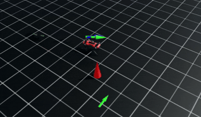

# Hierarchical Navigation for ANYmal-C on Rough Terrain


<p align="center">
  
</p>
<p align="center">
  
</p>
<p align="center">
  
</p>


## Overview
This project implements a **Hierarchical Reinforcement Learning (HRL)** framework for the ANYmal-C quadruped in **NVIDIA Isaac Lab**. It moves beyond standard flat-ground navigation by training a high-level planner to navigate complex, rough terrains populated with obstacles, using a pre-trained robust locomotion policy.

## Key Achievements

* **Hierarchical Architecture:** Decoupled control into a High-Level Navigation Policy and a Low-Level Locomotion Policy.
* **Rough Terrain Adaptation:** Successfully transferred navigation tasks to complex height-field terrains using a locomotion checkpoint trained for uneven ground.
* **Custom Goal Generation:** Developed the `ObstacleBlockedPoseCommand` to force the agent to circumvent obstacles by placing targets directly behind them relative to the robot's position.
* **Curriculum Learning:** Implemented multi-stage curricula for both goal distance and obstacle difficulty to stabilize training.

## Technical Details

### Architecture
* **Low-Level Policy:** A pre-trained blind locomotion policy responsible for maintaining balance and tracking velocity commands ($v_x, v_y, \omega_z$) on various terrains.
* **High-Level Policy:** A PPO-based navigation agent that observes the goal position and obstacle data to output high-level velocity commands to the locomotion policy.

### Obstacle-Blocked Command Logic
The `ObstacleBlockedPoseCommand` ensures interaction with obstacles by resampling goals based on the obstacle's location:
1.  **Vector Calculation:** Computes the vector from the robot to the obstacle (e.g., a cone).
2.  **Goal Placement:** Samples a target position at a specified distance range behind the obstacle along that vector, ensuring the robot must navigate around it to succeed.
3.  **Angular Curriculum:** Features an angular offset that starts wide (to allow a clear path) and decreases over time as the robot improves, forcing it to pass increasingly closer to the obstacle.

### Curriculum Learning
* **Distance Curriculum:** Dynamically increases the maximum goal distance (from 2m up to 6m) based on the agent's success rate.
* **Angle Curriculum:** Gradually reduces the goal's angular offset relative to the obstacle, intensifying the avoidance requirement as training progresses.
* **Terrain Curriculum:** Progresses through terrain levels as the robot demonstrates the ability to reach goals efficiently.

### Custom Rewards
* **`face_target`:** Penalizes the angular difference between the robot's forward vector and the target vector to eliminate unnatural "strafing".
* **`cone_proximity_penalty`:** Provides a negative reward if the robot's distance to the obstacle falls below a threshold (e.g., 0.6m).

## Installation

- Install Isaac Lab by following the [installation guide](https://isaac-sim.github.io/IsaacLab/main/source/setup/installation/index.html).
  We recommend using the conda or uv installation as it simplifies calling Python scripts from the terminal.

- Clone or copy this project/repository separately from the Isaac Lab installation (i.e. outside the `IsaacLab` directory):

- Using a python interpreter that has Isaac Lab installed, install the library in editable mode using:

    ```bash
    # use 'PATH_TO_isaaclab.sh|bat -p' instead of 'python' if Isaac Lab is not installed in Python venv or conda
    python -m pip install -e source/Anymal_Navigation

- Verify that the extension is correctly installed by:

    - Listing the available tasks:

        Note: It the task name changes, it may be necessary to update the search pattern `"Template-"`
        (in the `scripts/list_envs.py` file) so that it can be listed.

        ```bash
        # use 'FULL_PATH_TO_isaaclab.sh|bat -p' instead of 'python' if Isaac Lab is not installed in Python venv or conda
        python scripts/list_envs.py
        ```

    - Running a task:

        ```bash
        # use 'FULL_PATH_TO_isaaclab.sh|bat -p' instead of 'python' if Isaac Lab is not installed in Python venv or conda
        python scripts/<RL_LIBRARY>/train.py --task=<TASK_NAME>
        ```